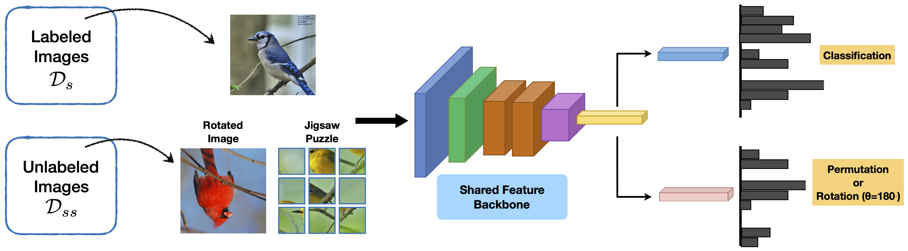

# When Does Self-supervision Improve Few-shot Learning?

This repo contains the source code of the paper:

"[When Does Self-supervision Improve Few-shot Learning?](https://arxiv.org/abs/1910.03560)", 
Jong-Chyi Su, Subhransu Maji, Bharath Hariharan, ECCV, 2020. <br>

[Project page](https://people.cs.umass.edu/~jcsu/papers/fsl_ssl/), [arXiv](https://arxiv.org/abs/1910.03560), [slides](http://supermoe.cs.umass.edu/fsl_ssl/long_video_slides.pdf)



The code is based on [the repo](https://github.com/wyharveychen/CloserLookFewShot) of "A Closer Look at Few-shot Classification", ICLR, 2019.

## Citation
```
@inproceedings{Su2020When,
	title = {When Does Self-supervision Improve Few-shot Learning?},
	author = {Jong-Chyi Su and Subhransu Maji and Bharath Hariharan},
	year = {2020},
	booktitle = {ECCV}
}
```

## Enviroment
 - Python3
 - PyTorch (tested on > 1.0.0)

## Getting started
### Prepare datasets
* Please download images of [Caltech-UCSD birds](http://www.vision.caltech.edu/visipedia/CUB-200-2011.html), [Stanford cars](https://ai.stanford.edu/~jkrause/cars/car_dataset.html), [fgvc-aircraft](http://www.robots.ox.ac.uk/~vgg/data/fgvc-aircraft/), [Stanford dogs](http://vision.stanford.edu/aditya86/ImageNetDogs/), and [Oxford flowers](https://www.robots.ox.ac.uk/~vgg/data/flowers/102/index.html), and put them under `filelists/${dset}/images`.

### Download mini- and tiered-ImageNet
* Change directory to `filelists/miniImagenet`
* run `source download_miniImagenet.sh` 

(WARNING: This would download the 155G ImageNet dataset. You can comment out correponded line 5-6 in `download_miniImagenet.sh` if you already have one.) 

### Base/Val/Novel splits
* Require three data split json file: 'base.json', 'val.json', 'novel.json' for each dataset.
* Splits are included in this repo.  


## Training (including test after training is done)
For baseline, run ```python train.py --dataset CUB --train_aug```

For jigsaw, run ```python train.py --dataset CUB --train_aug --jigsaw```

For rotation, run ```python train.py --dataset CUB --train_aug --rotation```

To use a separate unlabeled dataset for SSL, first make a json file for the unlabeled dataset (see original [repo](https://github.com/wyharveychen/CloserLookFewShot) for details).
Next, set `--dataset_unlabel` and `--base_unlabel` to the name of the json file. For example, to use 20% CUB dataset for supervised training (`CUB/base_20.json`) and 100% CUB for SSL (jigsaw) (`CUB/base.json`), run

```python train_separate.py --dataset CUB --dataset_unlabel CUB --base base_20 --base_unlabel base --jigsaw --lbda 0.5 --lr 0.001 --train_aug --n_query 5 --stop_epoch 600 --bs 64```

Note: For Mini-ImageNet and Tiered-Imagenet, please train the model for 600 epochs. For other datasets, 400 epochs are enough.

## Author
Jong-Chyi Su (UMass Amherst) `jcsu@cs.umass.edu`
